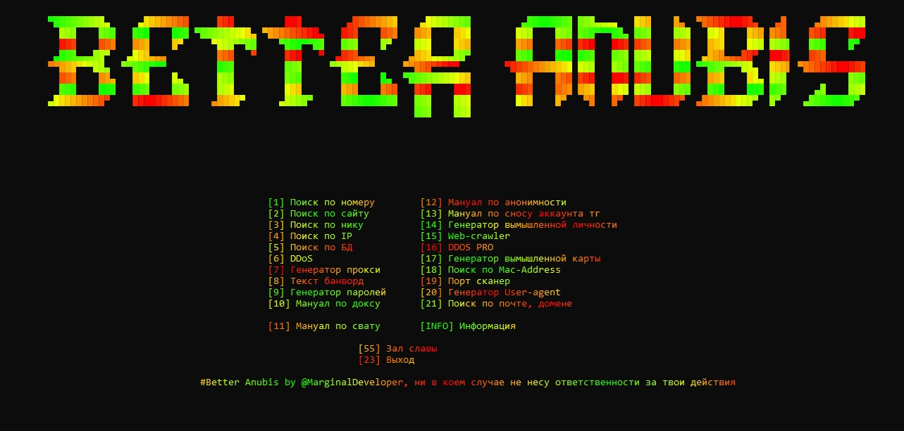

# **Better Anubis**  
**Многофункциональный инструмент для кибербезопасности и сбора информации**

**Better Anubis** — это мощный и универсальный инструмент, специально разработанный для выполнения широкого спектра задач в области кибербезопасности. С его помощью вы сможете эффективно собирать информацию, анализировать данные и защищать систему от угроз. Инструмент сочетает в себе как наступательные, так и оборонительные возможности, что делает его незаменимым для профессионалов в области информационной безопасности.

## **Ключевые возможности:**
- **Поиск по номеру** — быстрый поиск информации по телефонным номерам.
- **Поиск по сайту** — исследование данных, связанных с веб-сайтами.
- **Поиск по нику** — сбор информации по никам или псевдонимам пользователей.
- **Поиск по IP** — поиск данных по IP-адресам.
- **Поиск по базе данных** — доступ к данным из различных баз данных.
- **DDoS-атаки** — выполнение распределенных атак "отказ в обслуживании".
- **Генератор прокси** — создание анонимных прокси-серверов.
- **Баннер для блока** — генерация текста для банвора.
- **Генератор паролей** — создание надежных и безопасных паролей.
- **Мануал по доксингу** — руководство по сбору и публикации личной информации (доксинг).
- **Мануал по анонимности** — советы по обеспечению анонимности в сети.
- **Мануал по удалению аккаунта Telegram** — пошаговое руководство по удалению аккаунта в Telegram.
- **Генератор вымышленной личности** — создание фальшивых профилей.
- **Web-crawler** — веб-сканер для обхода сайтов.
- **DDoS PRO** — расширенные возможности для проведения атак DDoS.
- **Генератор вымышленной карты** — создание фальшивых карт.
- **Поиск по MAC-адресу** — поиск информации по MAC-адресам.
- **Порт-сканер** — сканирование открытых портов.
- **Генератор User-Agent** — генерация пользовательских агентов для браузеров.
- **Поиск по почте и домену** — поиск информации по электронной почте и домену.

## **Инструкция по установке и запуску:**

   git clone https://github.com/17murmuwer/Better-Anubis
   
   pip install -r requirements.txt   
   
   python Better_Anubis.py
